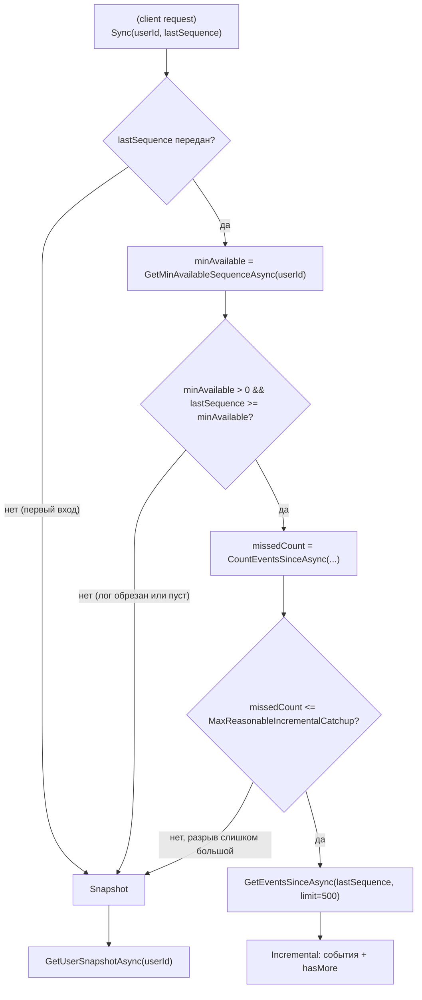
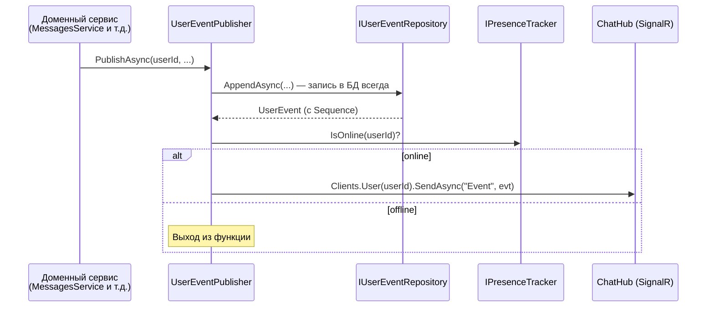

# PetChat API Server

Бэкенд сервера мессенджера на ASP.NET Core

## Стек

- **ASP.NET Core** (Controllers + SignalR Hub)
- **PostgreSQL** через `Npgsql.EntityFrameworkCore.PostgreSQL`
- **SignalR** — realtime-взаимодействие между клиентом (`/hubs/chat`)
- **Firebase Admin SDK** — push-уведомления для offline-пользователей
- **JWT** (HMAC-SHA256) — аутентификация
- **NLog** — логирование

## Ключевая структура

```
Controllers/             HTTP-эндпоинты (creditiolans(auth), chats, sync, fcm, users)
SignalR/Hubs/            ChatHub — realtime-канал (сообщения, typing, sync, ack)
SignalR/PresenceTracker/ кто сейчас держит открытое соединение
Services/
  DomainServices/        бизнес-логика мессенджера
  Synchronization/       механизм синхронизации клиента и сервера
  BackgroundServices/    UserEventTrimJob — фоновая обрезка лога событий
Database/
  Entities/Userspace/    User, Chat, ChatProperties, Message
  Entities/Serverspace/  UserEvent, UserAckState, UserRelations, UserFcmRegistration
  Repositories/          оперирование таблицами БД
```

---

## Механизм синхронизации

Клиент может разрывать соединение на произвольное время (закрыл приложение, потерял сеть, 
был оффлайн неделю) и должен каждый раз корректно и без потерь/дублей получать всё, 
что пропустил — без блокировок и координации по времени между сервером и клиентом.

### Основа: per-user лог событий + логические часы

Любое изменение состояния (новое сообщение, реакция, редактирование, статус нахождения в сети)
записывается в таблицу `user_events` — **отдельно для каждого затронутого пользователя**.
У каждого события есть `Sequence` — автоинкрементируемое число, играющее роль логических часов.
Клиент хранит `lastSequence` последнего успешно примененного события для последующей передачи 
серверу как начальной точки, с которой клиент получит новые события.

### `SyncService` — докатка логом или Snapshot состояния

> [!TIP]
> Snapshot состояния - снимок актуального состояния юзера. **В него не входят все пропущенные события**, 
> а только минимальная часть, отражающая актуальное состояние чатов и т.д. (например, самые актуальные `X` чатов, 
> последние `50` сообщений из каждого чата, ...). При дальнейшей необходимости клиент может получить 
> недостающие данные (например, следующее окно сообщений после последних 50), обратившись к `API`-эндпоинтам.



Ключевые решения:

- **`GetMinAvailableSequenceAsync` возвращает 0**, если лог для юзера пуст — трактуется как "докатка невозможна".
- Порог в 2000 пропущенных событий — если докатка возможна, но разрыв огромный, 
  сервис не гоняет клиента по десяткам запросов, а сразу отдаёт компактный актуальный снимок.
- Размер лога докатки — 500 событий за вызов (`SyncService.LogSize`); HTTP-эндпоинт 
  `GET /sync.sync?after=...&limit=...` даёт использовать другой лимит (по умолчанию 200, максимум 2000).

### `ISnapshotService`

Снимок должен сопровождаться числом `Sequence`, для которого верно следующее: "всё с `Sequence ≤ этого числа` 
уже отражено снимком, и ничего с `Sequence > этого числа` — не отражено". Если читать чаты/сообщения 
и максимальный `Sequence` отдельными запросами без общей транзакции — между этими чтениями может
проскочить новое событие, и число `Sequence` в ответе перестанет соответствовать факту.

`BeginTransactionAsync(IsolationLevel.RepeatableRead)` и `SET TRANSACTION READ ONLY` гарантируют, что все 
запросы внутри одной транзакции видят один и тот же согласованный срез БД — гонка устраняется на уровне СУБД.

### `UserEventPublisher` — Синхронизация при открытом соединении 



Открытый WebSocket — не гарантия доставки (клиент может отключиться/убить процесс между 
"сервер отправил клиенту событие" и "клиент обработал и сохранил локально в БД"), 
поэтому единственный надёжный источник — сам факт записи в таблицу `user_events`.
Живая отправка событий — быстрый способ доставить клиенту обновления.

### Эфемерные события — `PublishWithoutSavingAsync`

`UserTyping`/`UserStoppedTyping` **не пишутся** в `user_events` — они устаревают
за секунды: докатывать их клиенту, который был оффлайн, бессмысленно. Такие события 
не пишутся в БД, маркированы `Sequence = -1` и доставляются только если получатель
сейчас держит соединение — если нет, событие просто теряется, и это ожидаемое поведение.

### `Ack` и обрезка лога (`UserEventTrimJob`)

Клиент подтверждает не факт получения события по сети, а факт того, что он **сохранил** его 
локально на диск (иключает ситуации возникновения ошибки и аварийного завершения клиента в момент 
записи события локально на диск, что приводит к потере данных) — WebSocket вызовом `Ack(sequence)`. 

Фоновый `UserEventTrimJob` каждые 5 минут обрезает `user_events`:

- события, подтверждённые ack'ом — можно удалять, клиент их уже сохранил локально;
- события старше `maxLifeSpan` (7 дней) — удаляются независимо от ack, чтобы лог
  не рос бесконечно для пользователей, которые никогда не подтвердят (удалили приложение и т.д.).

Обрезка выполняется изолированно по каждому `UserId` — операции над одним пользователем не могут повлиять на лог другого.

---

## Аутентификация

`POST /creditionals.auth` / `POST /creditionals.register` — логин/пароль (PBKDF2-HMACSHA512) → 
JWT (HMAC-SHA256, живёт 7 дней, claims — `NameIdentifier (userId)` / `Name (user login)`). 
Заголовки `X-CLIENT-KEY`/`X-DEVICE-ID` проверяются `AccessMiddleware` (вне Development-окружения) — 
неизвестный клиент получает 404, забаненное устройство — 403.

При обычном логине (`Refresh: false`) лог событий пользователя очищается(`DeteleUserEvents`) — 
клиент получит актуальный snapshot вместо докатки; при `Refresh: true` (обновление 
токена без разлогинивания) лог сохраняется, докатка продолжается как обычно.

## Стиль API — RPC over HTTP

Контроллеры получают маршрут вида `{controller}.{action}` в нижнем регистре через 
`DotNotationRoutingConvention` (`chats.getHistory`, `fcm.register`, ...).
Метод — `GET` по умолчанию, если нет `[HttpPost]`

## Тесты
Юнит-тесты (`Tests/Unit`) — без внешних зависимостей, мокают репозитории/сервисы.

Интеграционные тесты (`Tests/Integration`) поднимают PostgreSQL в Docker через
Testcontainers и применяют реальные EF Core-миграции — **нужен запущенный
Docker** на машине, где гоняются тесты.